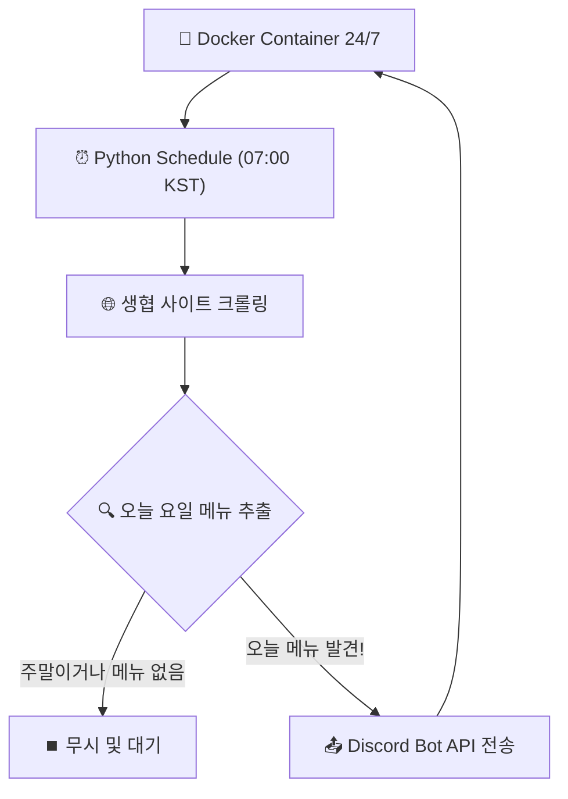

# 🍽️ KNU 학식 디스코드 알림 서비스 (knu_menus)

경북대학교 생활협동조합(생협) 사이트의 식단 정보를 자동으로 크롤링하여, 매일 아침 디스코드 채널로 예쁜 '오늘의 식단표'를 전송해주는 봇 서비스입니다.


---

## ✨ 주요 기능

- **6개 식당 전체 지원**: 복지관(첨성관), 정보센터, GP감꽃, 공학관(교직원/학생) 등 생협 운영 식당 올인원 지원.
- **일간 자동 전송 (스케줄러)**: 매주 평일(월~금) **아침 7시 정각(KST)**에 당일 요일에 해당하는 메뉴만 쏙 뽑아서 자동으로 전송합니다.
- **가독성 높은 Embed 디자인**: 코너(특식, 일반 등), 식사 시간대별(조식, 중식, 석식)로 깔끔하게 정리된 모바일 최적화 UI.
- **채널별 분리 관리**: 하나의 봇 토큰으로 6개의 채널에 각각 독립적인 알림 전송.
- **클라우드 & 도커 네이티브**: 복잡한 서버 세팅이나 가상환경 없이, `docker-compose` 명령어 한 줄로 24시간 봇이 백그라운드에서 동작합니다.

---

## 🏗️ 서비스 구조



---

## ⚙️ 설정 방법 (Setup)

### 1. Discord 설정
1. [Discord Developer Portal](https://discord.com/developers/applications)에서 봇을 생성하고 토큰을 복사합니다.
2. 봇을 서버에 초대합니다 (권한: `Send Messages`, `Embed Links`).
3. 식당별로 6개의 텍스트 채널을 만들고, 각 채널의 ID를 복사해둡니다.

### 2. 환경 변수 설정
프로젝트 최상단 경로에 `.env` 파일을 만들고 아래 내용을 채워넣습니다:

```env
DISCORD_BOT_TOKEN="내_디스코드_봇_토큰"
CHANNEL_CAFETERIA="채널ID"
CHANNEL_INFO_CENTER="채널ID"
CHANNEL_WELFARE="채널ID"
CHANNEL_GAMKKOT="채널ID"
CHANNEL_ENG_STAFF="채널ID"
CHANNEL_ENG_STUDENT="채널ID"
```

### 3. 서버에서 실행하기 (Docker)
서버나 로컬 환경에 Docker가 설치되어 있다면 단 한 줄로 실행이 끝납니다.

```bash
docker compose up -d
```

- `-d` 옵션을 주면 백그라운드에서 실행되며, 터미널을 꺼도 봇은 24시간 죽지 않고 평일 아침마다 식단을 배달합니다.
- 종료를 원할 경우: `docker compose down`

---

## 🛠️ 기술 스택

- **Language**: Python 3.12
- **Crawling**: Requests + BeautifulSoup4
- **Automation**: `schedule` + `pytz`
- **Deployment**: Docker, Docker Compose

---

## 📄 라이선스

이 프로젝트는 개인적인 용도로 개발되었으며, 경북대학교 생활협동조합 사이트의 정보 제공 방식에 따라 동작이 변경될 수 있습니다.
