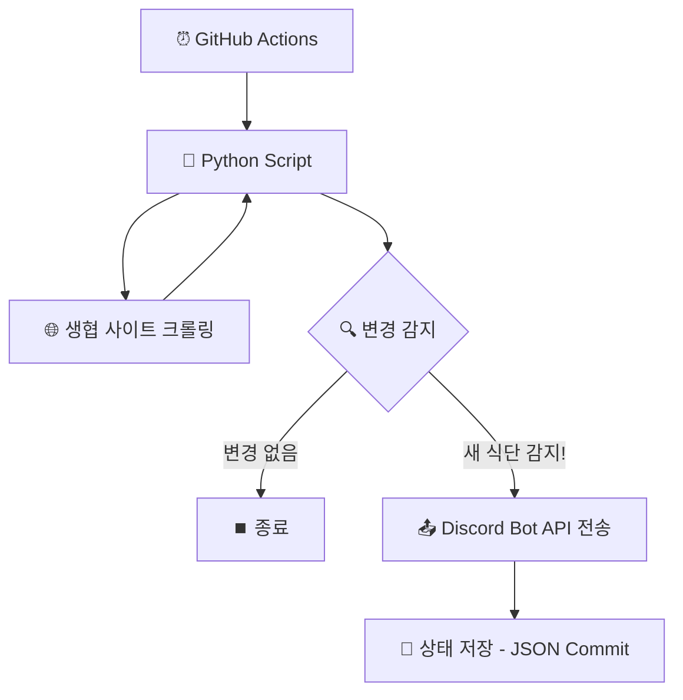

# 🍽️ KNU 학식 디스코드 알림 서비스 (knu_menus)

경북대학교 생활협동조합(생협) 사이트의 식단 정보를 자동으로 크롤링하여, 새로운 식단이 감지되면 디스코드 채널로 예쁜 주간 식단표를 전송해주는 서비스입니다.

---

## ✨ 주요 기능

- **6개 식당 전체 지원**: 복지관(첨성관), 정보센터, GP감꽃, 공학관(교직원/학생) 등 생협 운영 식당 올인원 지원.
- **변경 감지 시스템**: 생협 사이트를 주기적으로 체크하여 식단이 새로 업데이트되거나 수정되었을 때만 알림을 보냅니다. (불필요한 중복 알림 방지)
- **가독성 높은 Embed 디자인**: 요일별 고유 색상(월=초록, 화=파랑 등)과 이모지를 활용하여 모바일에서도 한눈에 들어오는 식단표 제공.
- **채널별 분리 관리**: 하나의 봇 토큰으로 6개의 채널에 각각 독립적인 알림 전송.
- **자동화 & 무료**: GitHub Actions를 활용하여 별도의 유료 서버 없이 하루 5회 자동으로 실행됩니다.

---

## 🏗️ 서비스 구조

---

## ⚙️ 설정 방법 (Setup)

### 1. Discord 설정
1. [Discord Developer Portal](https://discord.com/developers/applications)에서 봇을 생성하고 토큰을 복사합니다.
2. 봇을 서버에 초대합니다 (권한: `Send Messages`, `Embed Links`).
3. 식당별로 6개의 텍스트 채널을 만들고, 각 채널의 ID를 복사해둡니다.

### 2. GitHub Secrets 등록
GitHub 레포지토리의 **Settings > Secrets and variables > Actions**에 아래 항목들을 등록해야 합니다:

| Secret 이름 | 설명 |
|:---|:---|
| `DISCORD_BOT_TOKEN` | Discord 봇 토큰 |
| `CHANNEL_CAFETERIA` | 카페테리아 첨성 채널 ID |
| `CHANNEL_INFO_CENTER` | 정보센터식당 채널 ID |
| `CHANNEL_WELFARE` | 복지관-교직원식당 채널 ID |
| `CHANNEL_GAMKKOT` | GP감꽃식당 채널 ID |
| `CHANNEL_ENG_STAFF` | 공학관-교직원식당 채널 ID |
| `CHANNEL_ENG_STUDENT` | 공학관-학생식당 채널 ID |

---

## 🛠️ 기술 스택

- **Language**: Python 3.12
- **Crawling**: Requests + BeautifulSoup4
- **Automation**: GitHub Actions (Cron Scheduler)
- **Data Persistence**: JSON based state tracking

---

## 📄 라이선스

이 프로젝트는 개인적인 용도로 개발되었으며, 경북대학교 생활협동조합 사이트의 정보 제공 방식에 따라 동작이 변경될 수 있습니다.
